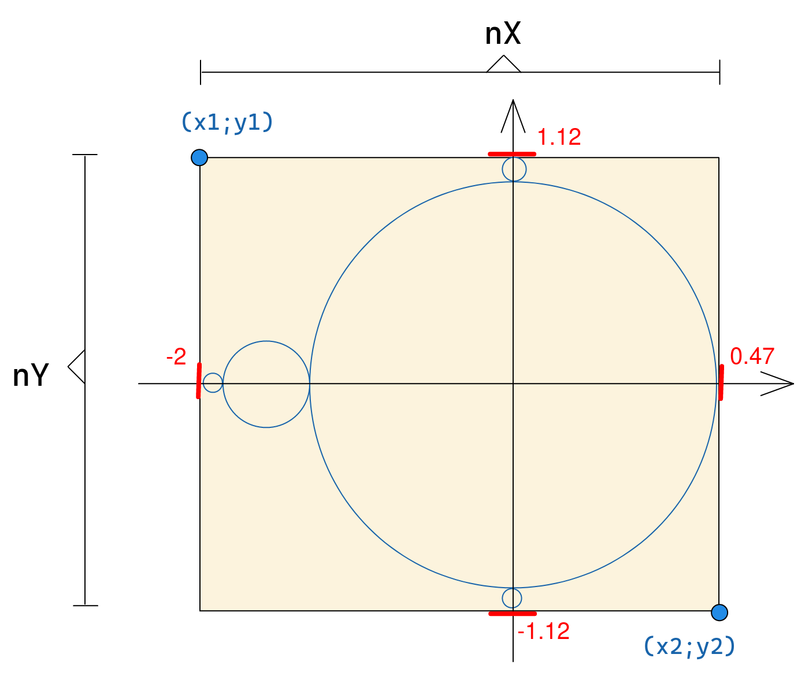

# Mandelbrot
Small project for the PRG1 class, to implement a [Mandelbrot](https://en.wikipedia.org/wiki/Mandelbrot_set) in command line in C++.  
The Mandelbrot set is a popular fractal that can be represented as an aesthetic image that you can zoom infinitly. Our project is to display a navigable mandelbrot in the terminal and that you are able to zoom in and out manually or see a animation with a predefined zoom.

## Visual appearance
todo

## Authors
- Samuel Roland
- Guillaume Gonin

## How to use
1. Clone the repos: `git clone https://github.com/HEIGVD-PRG1-F-2022/lab02-mandelbrot-team-guillaume-g-samuel.git`
1. Compile the project: `g++ *.cpp -o ./main`
1. Execute the binary: `./main`

The project can be developed and compiled with CLion too.

## Global working
This schema helps to have a visual understanding of the code and better understanding variables meanings.


## Pseudocode
As asked by the teacher, we took this piece of pseudocode from [the Wikipedia page about Mandelbrot](https://en.wikipedia.org/wiki/Mandelbrot_set#Computer_drawings) and we implemented it in the `mandelbrot()` function (in `mandelBrot.cpp`).

```
x := 0.0
y := 0.0
iteration := 0
max_iteration := 1000
while (x*x + y*y ≤ 2*2 AND iteration < max_iteration) do
	xtemp := x*x - y*y + x0
	y := 2*x*y + y0
	x := xtemp
	iteration := iteration + 1
```


## Review of the teacher
The code review and faculative grade is available here: https://github.com/HEIGVD-PRG1-F-2022/lab02-mandelbrot-team-guillaume-g-samuel/pull/1